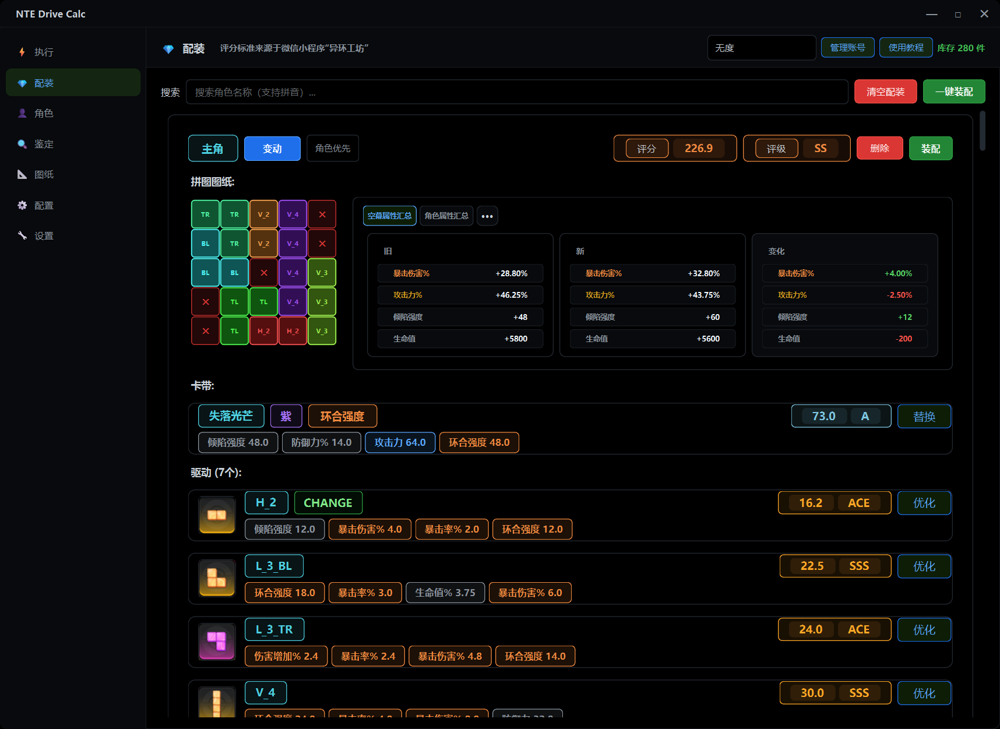
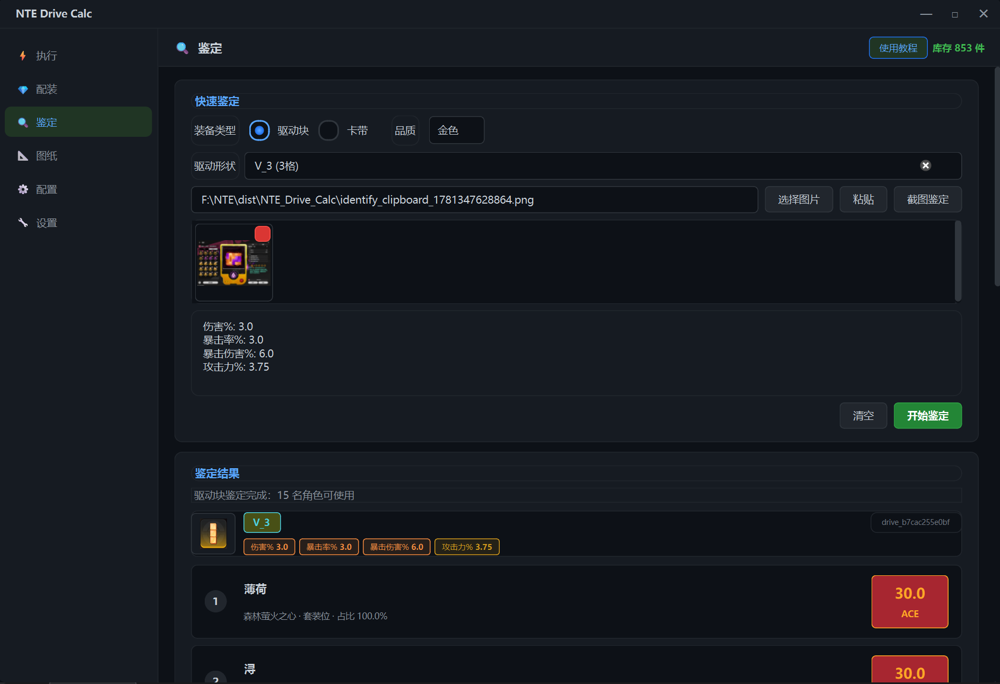
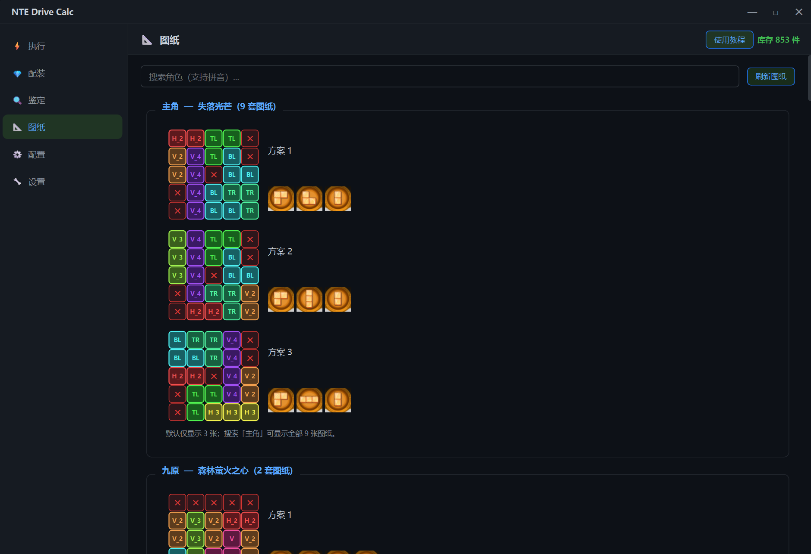
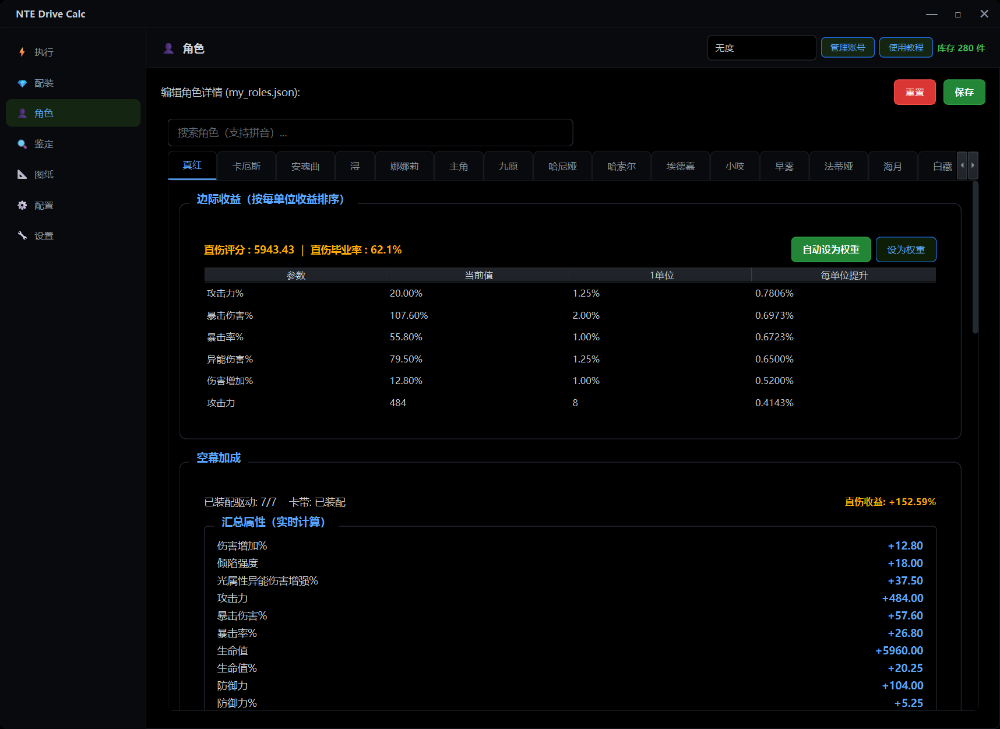
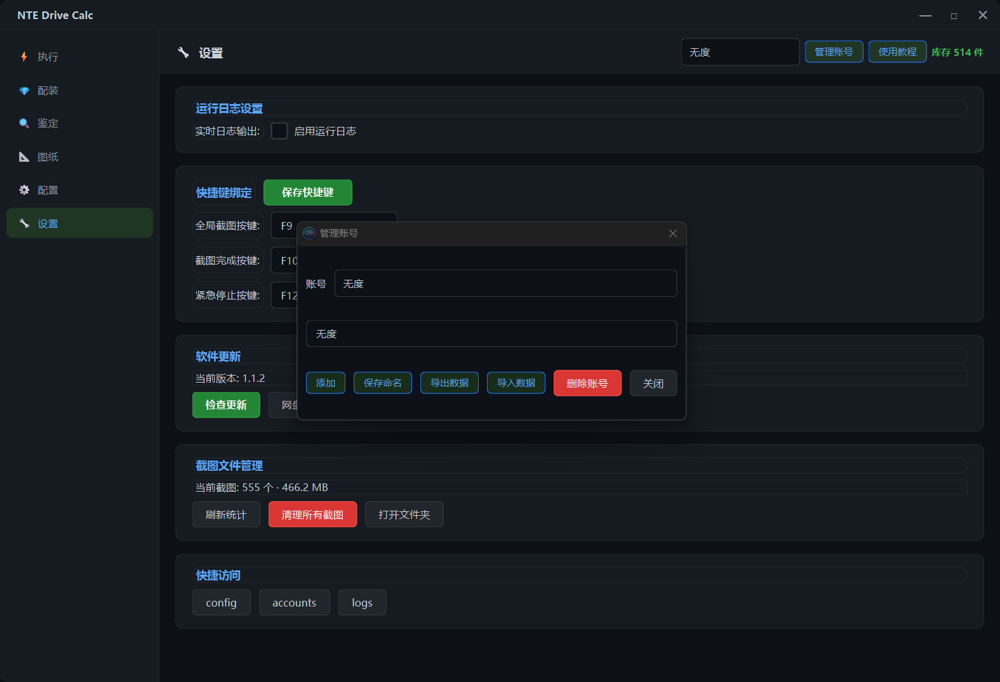
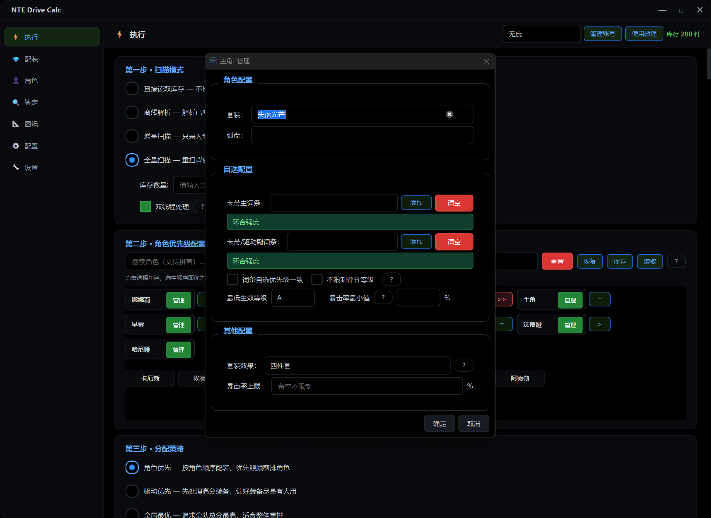

<div align="center">


<h1>异环驱动计算器</h1>
<p><strong>NTE Drive Calc</strong></p>

把《异环》背包截图变成可计算库存，用算法完成驱动卡带鉴定与全角色配装，并实现自动装配。

[](https://github.com/hxwd94666/NTE-Drive-Calc/releases)
[](#environment)
[](#development)
[](#intro)
[](https://github.com/hxwd94666/NTE-Drive-Calc/releases)

[下载安装](#download) · [功能亮点](#features) · [快速开始](#quick-start) · [反馈问题](#feedback)

</div>

<a id="intro"></a>

## 📖项目说明

异环驱动计算器是一款 Windows 桌面辅助工具，面向《异环》的驱动与卡带养成。

它解决的是玩家越到后期越常见的问题：

- 背包装备越来越多，手动记录和判断成本太高
- 多个角色抢同一批装备，不知道怎样分配更合理
- 新刷出的驱动、卡带到底值不值得留，缺少统一标准
- 想长期管理账号库存，但不想一直靠自己计算和记忆

本工具通过截图识别生成本地库存，再结合角色图纸、套装需求、词条权重和角色优先级，给出可落地的配装与自动化装配。

<a id="features"></a>

## ⭐️功能亮点

| 能力      | 解决什么问题                       |
|---------|------------------------------|
| 📷 背包扫描 | 全量扫描、增量扫描、离线解析，把驱动和卡带转成可计算库存 |
| 🔍 单件鉴定 | 看一件装备适合谁、评分多少、是否值得留下         |
| 🧮 生成配装 | 按角色图纸、套装、权重和优先级生成驱动与卡带方案     |
| 📐 自动装配 | 根据生成的配装去游戏内实现自动化的装配          |
| 👥 角色管理 | 管理角色套装、弧盘、词条偏好、已装备状态和自定义规则   |
| 📈 角色边际 | 计算当前角色最缺哪些属性，辅助调整词条权重        |
| 🧹 驱动处理 | 扫描完成后按评分、品质、类型自动锁定或弃置装备      |

<a id="preview"></a>

## 🔥界面预览

<table>
  <tr>
    <td align="center" width="50%">
      <strong>配装结果</strong><br>
      <sub>查看每个角色最终驱动、卡带和评分变化</sub><br><br>
      
    </td>
    <td align="center" width="50%">
      <strong>装备鉴定</strong><br>
      <sub>单件装备快速评分，判断适配角色和保留价值</sub><br><br>
      
    </td>
  </tr>
  <tr>
    <td align="center" width="50%">
      <strong>驱动处理</strong><br>
      <sub>按规则自动锁定、弃置或取消状态</sub><br><br>
      
    </td>
    <td align="center" width="50%">
      <strong>角色边际</strong><br>
      <sub>看清当前角色下一条词条选什么更赚</sub><br><br>
      
    </td>
  </tr>
  <tr>
    <td align="center" width="50%">
      <strong>配装优化</strong><br>
      <sub>对配装中不满意的驱动卡带进行替换优化</sub><br><br>
      
    </td>
    <td align="center" width="50%">
      <strong>角色管理</strong><br>
      <sub>自定义角色养成方向来影响配装分配</sub><br><br>
      
    </td>
  </tr>
</table>

<a id="download"></a>

## ⬇️下载安装

推荐下载最新版安装包：

- GitHub Release: <https://github.com/hxwd94666/NTE-Drive-Calc/releases>
- 夸克网盘: <https://pan.quark.cn/s/82f16b845aec>
- 百度网盘: <https://pan.baidu.com/s/1sPVqCpzmkQwKYCGstcZuIQ?pwd=ygke>
- B站主页: <https://b23.tv/nXJGdh3>
> 每次更新使用网盘转存会有一定收益，手机转存收益更高，大家可以支持一下。

安装时建议保留 `Install ViGEmBus virtual gamepad driver` 勾选。扫描功能需要虚拟手柄驱动来模拟背包翻页操作。

<a id="quick-start"></a>

## 🚀快速开始

1. 安装并打开软件。
2. 打开游戏内驱动或卡带背包。
3. 在执行页选择全量扫描，填写库存数量。
4. 扫描完成后选择需要配装的角色。
5. 选择分配策略，点击开始执行。
6. 查看配装结果，确认后保存装备锁定。
7. 游戏进入角色页面，进入配装页面点击装配

日常刷到新装备后，可以使用增量扫描和增量更新，不需要每次重建全部库存。

<a id="scenarios"></a>

## 🧰常用场景

- 第一次使用：全量扫描背包，生成本地装备库存。
- 刷到新装备：用增量扫描补录，不用重扫全部背包。
- 想知道装备值不值：用鉴定看评分、适配角色和保留价值。
- 想知道角色缺什么：用角色边际查看当前属性收益排序。
- 背包太满：扫描后管理可按评分、品质、类型自动弃置低价值装备。
- 多账号使用：账号数据独立保存，可导入导出备份。

<a id="environment"></a>

## 🖥️运行环境

- Windows 10/11 x64
- 游戏语言: 简体中文
- 推荐分辨率: 1080p、2K、4K 或 2560x1600
- 扫描功能需要 ViGEmBus 虚拟手柄驱动

<a id="feedback"></a>

## ❓️反馈问题

如果遇到识别错误、安装失败、扫描异常或配装结果不符合预期，请尽量附带：

- 问题截图
- 操作步骤
- 设置页开启运行日志后生成的日志文件
- 当前使用的软件版本

反馈入口：

- GitHub Issues: <https://github.com/hxwd94666/NTE-Drive-Calc/issues>

<a id="development"></a>

## 🧑‍💻本地开发

`2.0.0` 已使用 SQLite 作为运行数据边界，并以游戏官方 ID 驱动角色、库存和配装服务。详细设计见 [架构说明](docs/architecture.md) 与 [扩展指南](docs/extension-guide.md)。

```powershell
python -m venv .venv
.\.venv\Scripts\activate
pip install -r requirements.txt
python main.py
```

打包桌面程序：

```powershell
.\.venv\Scripts\python.exe .\build_exe.py
```

生成安装包：

```powershell
.\.venv\Scripts\python.exe .\build_installer.py
```

## 许可证与第三方组件

项目自有源代码以 [AGPL-3.0](LICENSE) 发布。随程序分发的 `nte-core.exe`、`dwmapi.dll` 与 ViGEmBus 是独立组件，其来源、适用条款和通知见 [NOTICE](NOTICE) 及 `third_party/`；根许可证不会改写它们各自的许可证或授权。

本工具为非官方玩家工具。游戏名称、角色、素材及相关权利归各自权利人所有；使用抓包、插件或自动化功能前，请自行确认适用的游戏规则、服务条款和当地法律。

## 👥贡献者

<a href="https://github.com/hxwd94666/NTE-Drive-Calc/graphs/contributors">
  
</a>

## 🤝致谢

- 异环工坊(微信小程序): 提供角色评分标准与词条权重参考
