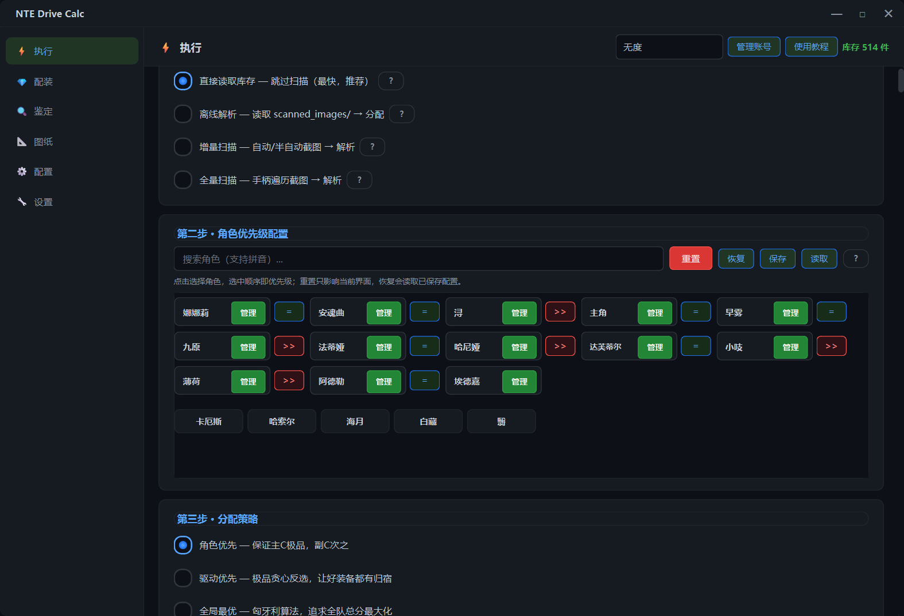
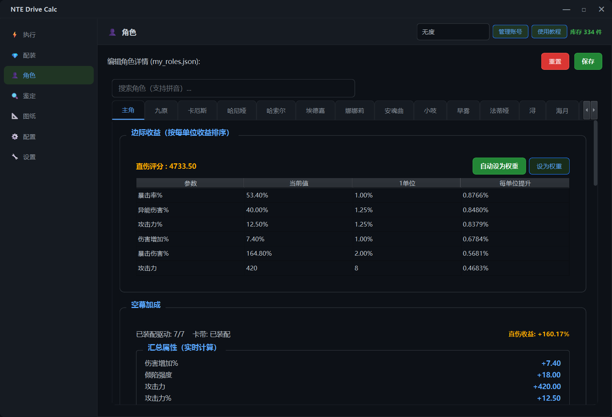

# 异环驱动计算器

[](https://github.com/hxwd94666/NTE-Drive-Calc/releases)
[](#运行环境)
[](#本地开发)
[](#运行环境)
[](https://github.com/hxwd94666/NTE-Drive-Calc/releases)

异环驱动计算器是一款 Windows 桌面工具，用来辅助整理、识别、评分和分配《异环》中的驱动与卡带。它面向日常配装使用：把背包里的装备截图解析成数据，再按照角色图纸、目标套装和词条权重给出配装方案，也可以单独对某个驱动或卡带做快速鉴定。

## 能做什么

- 把背包装备转成可计算库存：支持全量扫描、增量扫描、离线解析和单件鉴定，减少手动录入。
- 判断装备该给谁用：按角色权重、目标套装、图纸和词条评分，快速看出驱动/卡带的适配角色。
- 分析角色属性收益：查看当前直伤评分和各属性的每单位提升，辅助调整词条权重。
- 自动生成配装方案：按角色优先级分配装备，支持平级角色协同分配，并保留已有配装状态。
- 看清每次配装变化：标记新增装备，展示被替换掉的驱动/卡带，方便确认方案是否值得保存。
- 扫描后整理背包状态：可按评分、品质、类别、形状和套装自动锁定、弃置或取消状态，配合截图清理和账号导入导出管理长期数据。

## 适合谁用

- 背包装备很多，希望用扫描和解析快速建立库存的人。
- 经常刷驱动/卡带，希望当场判断装备该留、该锁还是该弃的人。
- 同时培养多个角色，希望装备分配少靠手算、多靠统一规则的人。
- 想知道当前角色最缺什么属性，并据此调整评分权重的人。
- 需要比较新旧方案，希望清楚看到哪些装备被替换、哪些装备是新增的人。
- 愿意调整角色权重、套装目标和筛选规则，希望配装更贴合自己账号的人。

## 下载安装

打开 GitHub Releases 页面，下载最新的安装包：

<https://github.com/hxwd94666/NTE-Drive-Calc/releases>

如果 GitHub 访问较慢，也可以使用网盘下载：

- 夸克网盘：<https://pan.quark.cn/s/82f16b845aec>
- 百度网盘：<https://pan.baidu.com/s/1sPVqCpzmkQwKYCGstcZuIQ?pwd=ygke>

下载 `NTE_Drive_Calc_Setup_x.x.x.exe` 后直接运行安装即可。安装程序需要管理员权限，因为它可能需要安装 ViGEmBus 虚拟手柄驱动。
当前安装包内置 Nefarius ViGEmBus `x64/x86/arm64` 合包驱动，安装时保持 `Install ViGEmBus virtual gamepad driver` 勾选即可。

安装完成后从桌面快捷方式或开始菜单启动程序。

软件启动后会自动检查版本更新；也可以在“设置 -> 软件更新”中手动检查更新、打开网盘下载或进入 GitHub 主页。自动检查只在发现新版本时弹出更新说明，网络失败时不会打扰当前操作。

## 常见功能说明

### 扫描

- 全量扫描：适合第一次使用，会覆盖式更新截图并重新生成库存。
- 增量扫描：适合日常新增装备，只处理新出现的驱动/卡带。
- 半自动截图：手动在游戏中切换装备，按截图快捷键连续抓取。
- 离线解析：读取 `scanned_images` 中已有截图，不重新操作游戏。 
应用截图：

### 扫描管理

全量扫描的库存数量旁提供“管理”按钮。管理窗口包含“弃置模块”和“锁定模块”，两个模块都可以独立开启或关闭。
应用截图：

### 角色管理

角色管理用于维护每个角色的实际状态，包括基础属性、弧盘、已装备驱动、卡带、套装加成和评分权重。这里的数据会直接影响鉴定评分、配装计算和边际收益分析。
你可以在这里查看角色当前装备带来的直伤收益，也可以根据角色需求调整权重、目标套装和图纸配置，让后续自动配装更贴近自己的账号养成方向。
应用截图：

### 配装

配装会根据角色图纸、驱动形状、卡带套装、品质、词条权重和角色优先级计算结果。你可以选择角色优先、驱动优先、全局最优或增量更新等策略。
角色优先支持平级批次；同一批次内会按局部全局最优尝试更合理地分配卡带和驱动。角色也可以单独设置套装效果要求，适配只需要二件套或不吃套装效果的用法。
保存过配装后，再次生成新方案会标记新增装备，并可通过“变动”按钮查看被替换掉的装备。
应用截图：

### 角色边际

角色边际用于分析单个角色当前面板下的属性收益。它会基于角色基础属性、弧盘、驱动、卡带和套装加成计算直伤评分，并列出攻击、暴击、暴伤、异能伤害等词条的每单位提升。
这个面板适合用来判断“下一条词条选什么更赚”。你可以直接查看收益排序，也可以把边际收益同步到角色权重，让后续鉴定和配装评分更贴近当前角色状态。
应用截图：

### 鉴定

鉴定用于快速判断单个或多个装备适合谁。支持图片识别和手动录入。图片不标准时，程序会让你手动确认驱动形状、卡带套装或主词条，避免误识别影响评分。
从剪贴板粘贴图片时，程序会临时保存图片用于解析；解析结束或失败后会自动清理这些临时文件，不会保留在账号目录中。
应用截图：

### 配置

配置用于自定义角色的实际参数和评分权重，以及各个套装的管理，仅用于有意者修改使用，一般玩家不要随意修改，以免引起评分系统错误。
角色权重、角色图纸、套装数据、词条池等配置会在安装更新时补齐新增字段，尽量不覆盖用户已有数据。
应用截图：

### 账号数据和文件清理

账号数据保存在 `accounts` 目录下。需要换设备时，可以在账号管理中导出当前账号数据，再在新设备中导入。导入同名账号会按替换覆盖处理。
设置页的“截图文件管理”会统计当前账号的扫描截图和临时鉴定粘贴图片。“清理所有截图”会保留增量扫描需要的 `raw_drive_0001.png`，并清理其它扫描截图和无用的 `identify_clipboard_*.png` 临时图片。

## 运行环境

- Windows 10/11 x64
- 推荐 1080p、2K、4K 或 2560x1600 分辨率
- 需要能正常截取游戏窗口
- 扫描模式需要 ViGEmBus 虚拟手柄驱动

OCR 默认优先使用 OpenVINO。若用户明确需要 DirectML GPU，可自行设置环境变量：

```powershell
$env:NTE_OCR_BACKEND = "directml"
```

一般用户不需要设置这个。

## 本地开发

建议使用虚拟环境：

```powershell
python -m venv .venv
.\.venv\Scripts\activate
pip install -r requirements.txt
python main.py
```

## 打包

生成桌面程序：

```powershell
.\.venv\Scripts\python.exe .\build_exe.py
```

生成安装包：

```powershell
.\.venv\Scripts\python.exe .\build_installer.py
```

如果已经存在 `dist\NTE_Drive_Calc`，只想重新生成安装包：

```powershell
.\.venv\Scripts\python.exe .\build_installer.py --skip-app-build
```

安装包输出位置：

```text
installer\output\NTE_Drive_Calc_Setup_x.x.x.exe
```

## 常见问题

### 全量扫描提示 VIGEM_ERROR_BUS_NOT_FOUND

这是 ViGEmBus 虚拟手柄驱动没有正常启动。请先重启电脑；如果仍然报错，打开开始菜单里的 `NTE Drive Calc -> Install ViGEmBus Driver` 重新安装/修复驱动，然后再次重启。

## 反馈

遇到识别错误、安装问题或配装结果异常，可以在 GitHub Issues 提交截图、日志和复现步骤：

<https://github.com/hxwd94666/NTE-Drive-Calc/issues>
