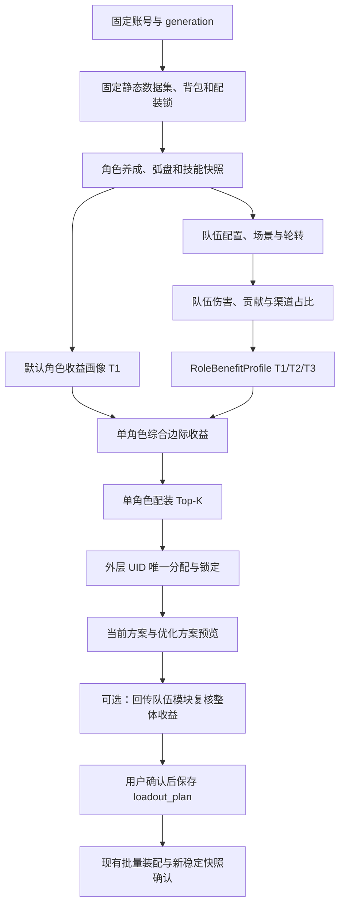

# NTE Drive Calculator 2.1.0：队伍收益与配装优化开发计划（临时）

> 文档状态：本地开发计划，持续更新
> 目标版本：NTE Drive Calculator `2.1.0`（开发中）
> 当前应用基线：`2.0.3`，分支 `2.0.3`
> 文档版本：`0.4.0`
> 初始整理日期：2026-08-04
> 当前执行方案：[2.1.0 战报收益画像后续方案](battle-report.md)
> 上游依赖：[2.1.0 nte-core 合作开发需求](nte-core-collaboration.md)

## 1. 终极目标

在固定账号、静态数据集、背包快照、角色养成、武器、队伍、战斗场景和计算配置下，得到
可解释、可复现并带数据质量说明的收益率，然后：

1. 从账号已有角色中寻找最佳四人队伍；
2. 为深渊寻找两个角色不重复的四人队伍，即最佳八人方案；
3. 队伍功能只向单角色配装功能传递角色收益画像；单角色配装在不感知队伍页面和队伍状态机的
   前提下优化驱动与卡带；
4. 同时给出角色直伤、DOT、不同环合伤害、倾陷伤害、Buff/Debuff 的贡献；
5. 给出当前方案、候选队伍、候选配装之间的收益率、数据来源、可信等级和具体变更；
6. 外层分配服务只负责多角色装备 UID 唯一性、计算保留锁和保存事务；
7. 用户确认预览后才保存新方案，之后仍走现有装配与稳定快照确认链路。

队伍组合选优目标不是“角色词条评分之和”，而是在同一冻结战斗上下文中计算的队伍收益。
装备优化保持单角色边界：队伍评价先投影出每个角色的 `RoleBenefitProfile`，单角色优化器再按
该画像计算综合边际收益并生成候选。现有多角色分配层只在这些候选之间解决 UID 冲突、优先级、
锁定和保存，不导入队伍伤害公式。

### 1.1 2.1.0 当前交付顺序

2.1.0 调整为“战报优先”：先用现有 nte-core 战斗摘要建立战报页面，产出明确标记
`summary_only` 的聚合技能/渠道占比、`RoleBenefitProfile`、单角色综合边际和聚合伤害配装权重。
独立的手工编队、最佳四人和最佳八人搜索暂缓，但本文定义的队伍、贡献和外层分配 contract
继续作为长期边界。

战报具体 schema、方法、页面和阶段以
[2.1.0 战报统计与收益画像开发方案](battle-report.md) 为准；本文不重复
定义传输和导入实现。

## 2. 核心口径

### 2.1 队伍价值与收益率

```text
队伍价值 V = 固定场景、固定时长和固定伤害轴规则下的期望总伤害或等价目标值

候选收益率 = (V(候选) / V(基线) - 1) × 100%
```

所有比较必须固定：

- 账号 ID 和 `AppContext.generation`；
- 静态数据集 ID；
- 背包 `snapshot_id`；
- 角色养成/武器快照；
- 队伍配置版本；
- 战斗场景、敌人和时长；
- 伤害轴/轮转配置版本；
- Buff 覆盖率来源；
- 优化 profile version；
- 计算器和求解器版本。

任一关键输入变化，都必须重新计算，不能把旧收益率套到新队伍或新背包上。

### 2.2 伤害归属与队伍贡献必须分开

- **伤害归属**回答“这次伤害记在谁名下”，适用于直伤、DOT、环合所有者和倾陷伤害；
- **队伍贡献**回答“这个角色加入队伍后，让队伍价值增加了多少”，包含增益、减抗、易伤、
  触发环合、改变覆盖率等间接收益；
- 环合伤害所有者不等于全部环合贡献者；触发者、元素搭档和 Buff 提供者都可能产生收益；
- 单纯将各角色“移除前后差值”相加会重复计算协同收益，不能作为可加总贡献。

四人队伍的角色总贡献优先采用精确 Shapley 分摊：四名角色只需要计算 16 个子集，能够公平
分配角色间交互收益并保证贡献总和与队伍价值一致。深渊八人是两个互相独立的四人战斗，
分别计算两队贡献，不对八人整体做同场 Shapley。

装备、单个 Buff 或单个效果的“关闭前后差值”可以作为可解释边际展示，但重叠效果的边际值
不保证可直接相加，界面必须标记这一点。

### 2.3 可信等级

| 等级 | 数据条件 | 是否允许自动终局选优 |
| --- | --- | --- |
| T0 不可用 | 关键角色、武器、公式或状态缺失 | 否 |
| T1 规则模型 | 手工角色/武器/轮转，覆盖率来自固定持续时间或用户输入 | 仅开发与预览，不称实测最优 |
| T2 已校准 | 有真实逐击伤害轴，伤害来源映射达到门槛，覆盖率仍含规则推算 | 可用于不依赖未知 Buff 的候选排序 |
| T3 实测 | 逐击伤害轴、状态区间、角色/武器/队伍快照完整并与计算场景匹配 | 可用于自动四人/八人及配装终局选优 |

可信等级不是对收益率乘一个随意折扣。求解器应设置最低可信门槛；未达到门槛的结果可以展示，
但不得伪装成可信自动推荐。

### 2.4 分渠道综合边际收益

单角色配装不接收整个队伍模拟器，只接收已经归一化的伤害渠道占比和效果覆盖率。

```text
角色某属性的综合边际收益
  = Σ(渠道实际伤害占比 × 该属性在该渠道中的相对边际收益)
```

以主角的直伤与创生花为例：

```text
总伤害 = 直伤 + 创生花伤害
创生占比 = 创生花伤害 / 总伤害

创生渠道的环合强度边际
  = 创生花伤害(环合强度 + 标准单位) / 创生花伤害(当前环合强度) - 1

环合强度的综合边际
  = 创生占比 × 创生渠道的环合强度边际
```

直伤不受环合强度影响时，其环合强度渠道边际为 0。一个属性同时影响多个渠道时，对所有受影响
渠道分别计算后求和。

`RoleBenefitProfile` 中的渠道占比统一定义为已经考虑轮转次数和覆盖率后的**实际期望伤害占比**。
因此环合强度等渠道属性不能再次乘同一覆盖率。武器或空幕 Buff 自身的增益仍需要在对应渠道中
按其 `CoverageResult` 计算生效前后差值。这样可以避免“渠道占比已经反映覆盖率，最后又乘一次
覆盖率”的重复折算。

队伍功能尚未完成时，由版本化默认模型提供伤害渠道占比和覆盖率，来源标记为
`project_default_estimate`，可信等级为 T1。不得在没有用户确认和证据的情况下把具体默认百分比
写死为实测值。

## 3. 目标业务链



## 4. 本地已有能力与复用边界

| 已有能力 | 主要结构/方法 | 2.1 复用方式 | 当前限制 |
| --- | --- | --- | --- |
| 角色养成与弧盘 | `character_profile`、`OfficialRoleProfileUpdate`、`OfficialRoleProfileService.save_profiles()` | 继续作为账号手工/计划养成配置 | 不是不可变实测快照，不能被上游同步静默覆盖 |
| 官方角色详情 | `load_official_role_detail()` | 取得成长、技能、觉醒、弧盘、图纸和装备上下文 | 返回字典偏重 UI，需要投影为领域 contract |
| 直伤边际 | `calculate_official_role_margins()` | 保留现有直伤结果，并作为综合边际中的一个渠道 | 当前只计算直伤，未纳入覆盖率、DOT、环合和队友影响 |
| 动态最终权重 | `calculate_official_role_final_weights()` | 保留为角色页只读说明及候选初筛 | 按单角色直伤边际归一化，不能直接作为队伍收益 |
| 单件收益/替换 | `calculate_official_role_item_gain()`、`replacement_candidates_for_official_role()` | 复用同一冻结装备上下文和替换安全规则 | 仅同形状/同套装局部替换，排序仍以装备评分为主 |
| 伤害纯函数 | `DamageCalculationService.calculate_direct()`、`calculate_dot()`、`calculate_topple()` | 作为队伍模拟的底层公式 | 尚无完整队伍轮转和全部环合状态机 |
| 环合基础 | `select_ring_owner()`、`TimedReactionState`、`DarkStarInstances` 等 | 继续扩展为纯领域状态机 | 部分状态时序仍是项目默认规则或待实测 |
| 固定配装输入 | `AllocationContext`、`build_allocation_context()` | 继续固定账号、静态库、背包、profile 和候选 | 没有队伍、战斗场景、角色养成快照和覆盖率 |
| 角色 Top-K | `RoleTopK`、`RoleAllocationOption`、`solve_allocation_context()` | 改为消费单角色综合收益权重并生成单角色候选 | Top-K 通过排除 UID 重跑；当前评分尚不认识收益画像 |
| 跨角色唯一分配 | `UnifiedAllocation` | 只保留 UID 唯一、优先级、锁定和未分配角色检查 | 不导入队伍公式，也不能直接给出最佳队伍 |
| 可复现预览 | `WeightedAllocationRequest`、`WeightedAllocationPreview` | 扩展为队伍收益预览的模式参考 | 没有队伍配置、战斗上下文和收益证据 |
| 方案保存/锁定 | `loadout_plan`、`AllocationLockSnapshot`、`replace_active_loadout_plans()` | 继续作为最终保存和计算保留边界 | 保存 payload 还没有队伍评价引用和收益口径 |
| 装配执行 | `BulkEquipmentApplyService` 和现有稳定快照确认 | 原样复用，不在 2.1 求解器中复制 RPC | 只接受已保存方案，符合终局设计 |

现有 `UnifiedAllocation.total_score` 是装备评分总和。2.1 不修改其既有含义；新增独立的队伍收益
结果，防止旧页面、保存方案和测试把两个不同分值混为一谈。

## 5. 数据所有权

| 数据 | 所有权 | 说明 |
| --- | --- | --- |
| 角色、成长、技能、觉醒、弧盘和装备效果定义 | 发行静态库 | 只由 `tools/game_data` 构建，运行时只读 |
| 伤害公式、环合状态和贡献分摊规则 | Domain/Service + 金标准文档 | 纯计算，不写静态库或账号库 |
| 账号手工角色养成/计划弧盘 | 账号库现有 `character_profile` | 用户明确配置，不能被自动同步静默覆盖 |
| 上游观测的角色/武器/队伍状态 | 账号库新增不可变观测快照 | 按上游 generation 和采集时间保存 |
| 用户保存的四人/八人队伍 | 账号库新增版本化队伍配置 | 使用官方 `character_id`，不保存中文名关系 |
| 战斗记录、逐击轴和状态区间 | 账号库新增战斗记录域 | 必须有保留/清理策略，避免无限增长 |
| 覆盖率和队伍评价 | 默认只存在不可变内存结果 | 只有用户保存优化预览时，才保存摘要和完整输入引用 |
| 动态词条最终权重 | 仅内存 | 继续禁止反写账号基础权重 |
| 额外形状用户覆盖 | 本机共享库 | 保持现有“共享覆盖 → 发行默认”规则 |

## 6. 需要新增或修改的数据结构

### 6.1 纯领域/不可变计算结构

建议在 `src/domain` 建立 Qt、SQLite 和 nte-core 无关的值对象。

#### `CharacterBuildSnapshot`

- `character_id`；
- 角色实例 UID，可为空；
- 等级、突破、觉醒；
- 各技能等级；
- `ForkBuildSnapshot`；
- 面板基础属性和可选实测面板；
- 数据来源：`manual_profile`、`nte_core_observation`、`static_default`；
- 来源快照 ID、generation 和采集时间；
- 完整性及未知字段。

现有 `character_profile` 继续表示用户的计划值。上游观测值进入独立快照，调用方通过明确的
`build_mode=planned|observed` 选择，禁止自动覆盖用户计划。

#### `ForkBuildSnapshot`

本项目现有代码中的 `fork` 即角色弧盘/武器模型：

- 官方 `fork_id`；
- 可选实例 UID；
- 等级、突破阶段、精炼等级；
- 静态属性项；
- 条件被动效果 ID；
- 数据来源和完整性。

#### `TeamDefinition` / `AbyssTeamDefinition`

- 队伍配置 ID 和版本；
- 普通队伍固定 4 个槽位；
- 深渊配置固定上半、下半两队，共 8 个不重复角色；
- 每个槽位保存 `character_id`、位置和可选战斗职责标签；
- 手工配置或上游观测来源；
- 完整性和变更 generation。

战斗职责标签只能用于候选剪枝和解释，不能代替真实伤害计算。

#### `CombatScenario`

- 场景 ID、敌人/深渊关卡及上下半；
- 敌人等级、防御、抗性、倾陷上限；
- 战斗时长和是否扣除时停；
- 单目标/多目标和波次规则；
- 上半、下半权重；
- 场景版本和数据来源。

#### `RotationProfile`

- 版本化伤害轴或规则轮转；
- 每个角色的技能/命中事件；
- DOT 施加、刷新、结算；
- 环合触发和角色切换；
- Buff/Debuff 事件；
- 来源：实测轴、规则模板或手工配置；
- 时间基准、时长和完整性。

#### `CombatEffectDefinition`

- 稳定效果 ID；
- 来源类型和来源官方 ID；
- 触发条件；
- 作用对象和伤害范围；
- 乘区：属性、增伤、易伤、暴击、防御、抗性、独立乘区等；
- 数值、持续时间、最大层数；
- 刷新、叠层和冲突规则；
- 静态来源及确认状态。

#### `EffectInterval` / `CoverageResult`

`EffectInterval` 保存开始、结束、层数、来源和作用对象。`CoverageResult` 至少包含：

- 时间覆盖率；
- 命中覆盖率；
- 伤害覆盖率；
- 分子、分母和适用伤害范围；
- `measured|rule_estimated|manual|unknown` 来源；
- 战斗记录 ID 或规则版本；
- 事件丢失、未映射数量和可信等级。

#### `DamageShare` / `RoleBenefitProfile`

`DamageShare` 表示一个角色在固定队伍/默认模型中的实际期望伤害构成：

- 渠道 ID；
- 实际期望伤害；
- 归一化占比；
- 对应轮转次数和覆盖率引用；
- 来源及可信等级。

`RoleBenefitProfile` 是队伍功能和单角色配装之间唯一共享的公开 contract：

- `character_id`；
- 场景和角色养成指纹；
- 各 `DamageShare`，总和必须为 1；
- 武器、空幕和角色 Buff 的 `CoverageResult`；
- 每个渠道允许进入的属性/效果集合；
- `project_default_estimate|manual|team_modeled|measured` 来源；
- profile version、可信等级和未知原因。

队伍 Service 可以生产该结构，但单角色 Service 不导入队伍 Service。没有队伍结果时，默认画像
工厂生产同一个结构，因此单角色配装的调用链不需要分叉。

#### `ChannelMarginalResult` / `CompositeMarginalResult`

`ChannelMarginalResult` 保存某个标准属性单位在一个伤害渠道中的基线、变化后伤害和相对收益。
`CompositeMarginalResult` 保存：

- 属性 ID 和标准单位；
- 每个渠道的占比、渠道边际和加权贡献；
- 综合边际收益；
- 使用的覆盖率和收益画像版本；
- 可信等级和解释文本。

角色页现有直伤 `gain_percent` 保持原含义；新增综合边际字段和表格，不用新语义覆盖旧字段。

#### `DamageChannelResult`

伤害渠道至少包括：

- `direct`：角色直伤；
- `dot`：DOT 单跳及结算；
- `reaction_creation`：创生；
- `reaction_weave`：覆纹；
- `reaction_burning`：浊燃；
- `reaction_dark_star`：黯星；
- `reaction_infusion`：浸染带来的增益贡献；
- `reaction_other`：其他环合；
- `topple`：倾陷；
- `shared_or_unattributed`：共享机制或未归因。

每项同时保存伤害所有者、触发者、受益角色和计算证据。

#### `TeamEvaluation`

- 冻结输入引用；
- 队伍总价值、DPS 和分渠道伤害；
- 每个角色的伤害归属；
- 每个角色的 Shapley 队伍贡献；
- Buff/效果关闭前后边际贡献；
- 覆盖率明细；
- 未归因伤害；
- 可信等级和阻止自动选优的原因；
- 计算器版本和 context fingerprint。

#### `BenefitComparison`

- 基线评价；
- 候选评价；
- 总收益率；
- 分渠道收益率；
- 角色和效果贡献变化；
- 可信等级是否满足自动优化门槛；
- 所有变化的装备 UID 和方案 ID。

#### `TeamSearchContext` / `TeamSearchPreview`

`TeamSearchContext` 冻结账号、generation、角色养成、队伍候选、场景、轮转、效果目录和队伍
评价版本。它只负责寻找四人/八人组合并为入选角色生成 `RoleBenefitProfile`，不持有装备候选。

`TeamSearchPreview` 只包含该 Context 产生的：

- 当前四人/八人基线；
- Top-K 队伍组合及每名角色的收益画像；
- 收益比较和数据质量；
- 供后续单角色配装调用的完整不可变签名。

#### `RoleLoadoutOptimizationContext` / `RoleLoadoutOptimizationPreview`

该 Context 冻结一个角色、背包、配装锁、现有方案、优化 profile 和一个
`RoleBenefitProfile`。Preview 返回该角色的 Top-K 完整配装、综合收益、方案差异和保存签名。

当多个角色一起计算时，应用 Service 收集各角色 Preview，再交给现有分配层解决 UID 唯一性。
分配层可以按优先级或综合收益选择候选，但不得反向调用队伍 Service。

保存和替换只能消费原 Preview，不能重新打开“当前账号”补齐旧结果。

### 6.2 账号 SQLite 新结构

表名和迁移版本在实现阶段最终确认，但业务所有权先固定如下。

#### 不可变角色观测域

- `character_observation_snapshot`：来源、generation、sequence、采集时间、协议版本、完整性；
- `character_observation`：角色 ID/UID、等级、突破、觉醒、弧盘 ID/UID/等级/突破/精炼；
- `character_observation_skill`：角色、技能 ID 和技能等级。

该域不替换 `character_profile`。角色页可以显示“游戏观测”和“计划配置”并让用户明确选择
计算来源。

#### 版本化队伍配置域

- `team_profile`：队伍配置名称和是否活动；
- `team_profile_version`：单队/深渊双队、版本号和创建时间；
- `team_profile_member`：team index、slot、官方角色 ID；
- 可选 `observed_team_snapshot`：保存上游自动观测的普通队伍/深渊双队，不覆盖用户队伍配置。

#### 战斗记录域

- `battle_record`：上游记录 ID、捕获 operation、场景、开始/结束、质量和固定快照引用；
- `battle_damage_event`：分页/批量导入的逐击数据；
- `battle_effect_interval`：Buff/Debuff 合并区间；
- `battle_record_quality`：丢包、未映射和来源统计。

战斗记录必须新增保留数量/天数设置。受已保存评价引用的记录不能被自动清理。

#### 队伍搜索与收益画像记录域

- `team_search_run`：Context 指纹、输入快照/版本、状态、可信等级和目标；
- `team_search_candidate`：仅保存用户明确保留的 Top-K 队伍摘要；
- `team_search_profile`：候选角色和该队伍生成的收益画像摘要，不直接拥有装备候选；
- 单角色配装 Preview 保存时在 `loadout_plan.payload_json` 记录收益画像版本和来源，后续需要查询
  历史时再评估是否建立独立的 `role_loadout_optimization_run` 表。

动态最终权重不进入这些表。保存的是一次可复现评价及其输入引用，不是新的账号基础权重。

### 6.3 发行静态库新增结构

需要规范化、可复用且来自官方文件的效果定义，才进入下一版静态 schema：

- `combat_effect_definition`：技能、觉醒、弧盘、套装、卡带效果；
- `combat_effect_term`：各乘区、数值、对象和适用伤害范围；
- `combat_effect_trigger`：触发、持续、刷新和层数规则；
- `combat_effect_semantic_mapping`：Ability/GameplayEffect 与本地稳定效果 ID 的映射。

无法从官方文件确认的项目规则继续写入金标准文档和纯领域代码，必须标记 `project_rule`，不得
伪装成官方静态数据。运行时静态库仍保持只读，所有新增表只由 `tools/game_data` 写入。

## 7. 需要新增或调整的主要方法

### 7.1 角色与观测装配

建议新增：

- `import_character_observation_snapshot(...)`：Integration DTO → 账号不可变观测快照；
- `load_character_build_snapshot(...)`：按 planned/observed 模式构造 `CharacterBuildSnapshot`；
- `resolve_fork_build(...)`：弧盘 ID、等级、突破、精炼 → 静态属性与效果；
- `compare_planned_and_observed_build(...)`：只返回差异，不自动覆盖用户配置；
- `build_character_combat_profile(...)`：角色养成、弧盘、装备和静态技能 → 纯计算输入。

现有 `OfficialRoleProfileService.save_profiles()` 保留手工保存语义，不改成同步写入口。

### 7.2 效果与覆盖率

建议新增：

- `compile_character_effects(build, equipment, static_catalog)`；
- `compile_team_effects(team, scenario)`；
- `merge_effect_events(events)`：应用/刷新/层数/移除 → 不重叠有效区间；
- `calculate_effect_coverage(intervals, eligible_hits, active_time)`；
- `estimate_rule_coverage(trigger_schedule, duration, refresh_rule)`；
- `apply_effects_at_time(base_input, effects, timestamp, target)`；
- `coverage_quality_report(...)`。

武器和空幕 Buff 只有在转为 `CombatEffectDefinition + CoverageResult` 后，才能进入边际收益；
不得把“描述持续 12 秒”直接当作固定 100% 覆盖。

### 7.3 单角色综合边际收益与配装

建议新增：

- `build_default_role_benefit_profile(character_id, scenario, version)`；
- `validate_role_benefit_profile(profile)`；
- `calculate_channel_marginals(build, profile, property_unit)`；
- `calculate_composite_marginal(channel_marginals, profile)`；
- `calculate_official_role_composite_margins(...)`；
- `build_role_loadout_optimization_context(...)`；
- `optimize_single_role_loadout(context)`；
- `compare_role_loadout_to_saved_plan(preview)`。

单角色优化器只接受 `RoleBenefitProfile`，不接收队伍页面、队伍成员列表或队伍 Service。默认画像
和队伍画像共用完全相同的校验与计算入口。

### 7.4 队伍伤害、贡献与收益画像生产

建议新增：

- `build_team_combat_context(...)`：冻结四人队、场景、轮转和效果；
- `simulate_team_damage(context)`：输出 `TeamEvaluation`；
- `calculate_damage_channels(...)`：直伤/DOT/环合/倾陷分渠道；
- `attribute_damage_ownership(...)`：处理伤害记名；
- `calculate_role_shapley_contributions(...)`：四人 16 子集精确分摊；
- `calculate_effect_marginals(...)`：逐效果关闭前后差值；
- `compare_team_evaluations(baseline, candidate)`；
- `project_role_benefit_profiles(team_evaluation)`：把队伍结果收敛为四份公开收益画像；
- `calibrate_modeled_rotation(measured_axis, modeled_rotation)`。

`DamageCalculationService` 继续只拥有单次公式。轮转、状态机和贡献分摊放在新的 Service/Domain，
不把队伍状态塞入现有单次伤害 dataclass。

### 7.5 四人/八人队伍搜索

建议新增：

- `generate_team_candidates(roster, constraints)`；
- `prune_team_candidates_by_compatibility(...)`：只做安全剪枝，不直接决定最终收益；
- `evaluate_four_character_teams(...)`；
- `pair_disjoint_abyss_teams(...)`：保证八个角色不重复；
- `rank_team_candidates(...)`：按同一 `TeamObjective` 和可信门槛排序；
- `explain_team_candidate(...)`。

四人候选数量可控时优先精确枚举。八人方案先各自生成上/下半 Top-K 四人队，再做不重复角色
的组合与重评，避免直接遍历全部八人排列。

### 7.6 多角色装备唯一分配与可选复核

建议新增：

- `collect_role_loadout_previews(...)`：收集互不依赖的单角色 Top-K；
- `allocate_unique_role_loadouts(...)`：每个角色选择一套，真实 UID 全局唯一；
- `compare_allocated_loadouts_to_saved_plans(...)`；
- `recheck_allocation_locks(...)`；
- `build_allocation_preview(...)`；
- `save_allocation_preview(...)`；
- `request_team_revalidation(...)`：可选地把确定后的角色配装快照交给队伍评价 Service 复核。

建议求解分层：

1. 默认或队伍模块生成每个角色的 `RoleBenefitProfile`；
2. 单角色 Service 计算综合边际权重；
3. 现有硬过滤、图纸和 ScoringEngine 生成各角色完整 Top-K；
4. 外层分配器按角色优先级/综合收益在 Top-K 间选择，并强制 UID 唯一；
5. 从当前保存方案开始做单角色替换或角色间交换，直到没有正收益或达到固定预算；
6. 如需更高精度，由应用 Service 把最终配装回传队伍评价做一次整体复核；
7. 输出预览，不直接保存或装配。

回传复核是公开 contract 之间的有界编排，不允许单角色优化器导入队伍 Service，也不允许队伍
Service 读取装备 DAO。第一版可以不做迭代，只执行一次“画像 → 单角色优化 → 唯一分配”。

现有 `role_search_limit`、`global_search_limit` 参数当前没有控制实际搜索，2.1 新求解器必须让搜索
预算成为真实生效、写入 Context 且可复现的配置。

## 8. 短期合理目标

合作方完整逐击 RPC 交付前，先利用现有 nte-core 摘要完成低可信等级的战报收益闭环。个人本地
逐击 JSON 不是产品输入。

### 阶段 S0：冻结公共口径和 contract

范围：

- 固定本文的数据结构和收益率口径；
- 固定“伤害归属”和“队伍贡献”双指标；
- 固定 planned/observed 角色养成并存；
- 固定 T0～T3 可信等级；
- 固定战报伤害所有者、渠道、实测伤害配装权重和综合边际口径。

完成标准：只有文档和纯 contract 决策，不修改评分或数据库语义。

### 阶段 S1：战报聚合统计与收益画像

范围：

- 用现有 nte-core 方法展示实时摘要并保存 `summary_only` 战报；
- 按 GE 静态映射统计角色、技能、直伤、DOT 和明确环合渠道；
- 分离角色、反应所有者、共享、环境、倾陷和未归因伤害；
- 从聚合摘要生成版本化、明确标记低可信等级的 `RoleBenefitProfile`；
- 没有可用战报时才回退 `project_default_estimate`，不得冒充实测。

完成标准：上下半独立对账；技能/渠道占比可追溯到分子分母；共享和环境伤害不进入角色自身
词条边际；同一输入重复结果一致。

### 阶段 S2：单角色综合收益与配装优化

范围：

- 角色页保留现有直伤边际，并新增综合边际；
- 按战报中每个 GE 的聚合伤害占比计算分来源、分渠道和综合边际；
- 从聚合收益画像生成单角色综合权重；
- 仅在有状态区间或明确规则时，将弧盘和空幕 Buff 覆盖率计入对应渠道；
- 单角色优化器基于现有保存方案生成 Top-K 改进方案；
- 只生成 Preview，不自动保存。

完成标准：不适用渠道边际为 0；综合边际等于分来源加权和；动态综合权重不写基础权重；
单角色优化不导入战报页面或队伍模块。

### 阶段 S3：多角色唯一分配与当前方案比较

范围：

- 从现有活动 `loadout_plan` 构造各角色基线；
- 收集多个单角色 Top-K；
- 外层解决装备 UID 冲突和计算保留锁；
- 按各角色自身收益画像比较配装前后收益率；角色争夺装备时再乘所在半场聚合伤害权重；
- 展示装备 UID、角色/渠道收益变化和方案差异；
- 只生成 Preview，不自动保存。

完成标准：锁定方案不可被改变；候选真实 UID 不重复；收益比较不重新读取移动中的当前快照。

S0～S3 是合理短期目标。完整逐击 RPC 未开放时，现有 stdio 只提供实时和最终聚合，输出必须
保持 `summary_only` 可信等级；没有兼容战报时才使用明确标记的默认画像。

## 9. 中长期阶段

### 阶段 M1：接入合作方角色、武器和队伍快照

- 导入不可变观测快照；
- 角色页并列显示游戏观测与计划配置；
- 自动匹配官方角色/弧盘 ID；
- 接入当前四人队和深渊双队；
- 缺失字段保持 unknown，不猜测。

### 阶段 M2：接入合作方完整逐击 RPC 和状态区间

- 接入分页 `battle.get_axis` 和稳定战斗记录 ID；
- 导入状态区间和完整战斗上下文；
- 对伤害来源、覆盖率和公式模型做校准；
- 输出 T2/T3 质量；
- 建立战斗记录保留和清理策略。

### 阶段 M3：四人队伍评价与收益画像

- 用户选择或观测四名角色；
- 计算伤害归属、Shapley 贡献和渠道占比；
- 为四名角色分别输出 `RoleBenefitProfile`；
- 单角色配装可以从默认画像无缝切换到队伍画像；
- 团队结果不包含装备候选或装备 DAO。

### 阶段 M4：最佳四人/深渊八人队伍

- 从账号可用角色池生成四人组合；
- 用同一场景和可信门槛评价；
- 返回 Top-K、收益率、贡献和替代角色解释；
- 分别生成上半、下半四人 Top-K；
- 配对为角色不重复的八人方案；
- 按用户确认的双队目标函数排序；
- 展示每半场收益、瓶颈和总目标。

本阶段不改变配装，先冻结纯队伍组合和每名角色的收益画像。

### 阶段 M5：收益画像驱动的单角色配装与外层分配

- 队伍模块为入选角色生成收益画像；
- 单角色优化器分别生成 Top-K 配装；
- 外层分配器在固定背包内选择，确保 4/8 角色装备 UID 唯一；
- 尊重所有 `AllocationLockSnapshot`；
- 以现有活动方案为基线计算可信收益率；
- 输出局部替换方案、联合重排方案和 Top-K 备选；
- 用户确认后通过现有 `replace_active_loadout_plans()` 保存；
- 装配继续由现有批量装配 Service 执行和确认。

## 10. 最终交付形态

### 最佳四人队伍结果

- 四名角色和位置；
- 固定场景、轮转和数据版本；
- 当前队伍价值、候选价值和收益率；
- 直伤、DOT、各环合、倾陷和 Buff 收益；
- 伤害归属与角色队伍贡献；
- 覆盖率及证据；
- 每名角色独立收益画像、建议配装和装备变更；
- T0～T3 可信等级及限制；
- Top-K 替代队伍。

### 最佳深渊八人结果

- 上半、下半各四人；
- 两半各自价值、收益率和贡献；
- 双队目标值及瓶颈半场；
- 八人不重复、装备 UID 不重复；
- 两队各角色独立优化、外层唯一分配后的配装差异；
- Top-K 双队备选及换人代价。

### 保存与装配

- 推荐结果先是不可变 Preview；
- 保存前复核账号、generation、背包、profile、队伍版本和配装锁；
- 生成新活动 `loadout_plan`，保留原方案历史，不原地篡改旧方案；
- 装配前继续执行现有完整预检查；
- RPC 接受不等于成功，最终由新稳定快照确认。

## 11. 明确不做的捷径

- 不把四名角色的单人边际收益简单相加作为队伍价值；
- 不把伤害所有者直接等同于队伍贡献者；
- 不把武器或空幕描述中的持续时间直接当作 100% 覆盖率；
- 不把当前 `UnifiedAllocation.total_score` 政名后冒充队伍伤害；
- 不让队伍 Service 直接生成装备候选或操作配装 DAO；
- 不让单角色优化器导入队伍 Service 或读取队伍页面状态；
- 不将动态综合权重写回账号基础权重；
- 不让 Optimizer 读取 SQLite、Qt 页面或当前账号全局状态；
- 不绕过配装锁、原生 UID 唯一约束和固定 `snapshot_id`；
- 不在没有 T2/T3 证据时宣称找到可信的实测最优队伍；
- 不为实现队伍功能恢复页面间私有调用或 MainWindow 暗链。

## 12. 实施文件规划

实际文件名可以在阶段 contract 审查时调整，职责边界不得变化。

| 层 | 建议位置 | 职责 |
| --- | --- | --- |
| Domain | `src/domain/combat_effects.py` | 效果、区间、覆盖率值对象 |
| Domain | `src/domain/team_combat.py` | 队伍、场景、轮转和伤害渠道值对象 |
| Domain | `src/domain/team_benefit.py` | 评价、贡献、收益画像和收益比较值对象 |
| Service | `src/services/character_build_service.py` | planned/observed 角色和弧盘装配 |
| Service | `src/services/effect_coverage_service.py` | 区间合并和覆盖率 |
| Service | `src/services/team_damage_service.py` | 队伍伤害模拟编排 |
| Service | `src/services/role_benefit_service.py` | 默认/队伍收益画像与单角色综合边际 |
| Service | `src/services/role_loadout_optimizer.py` | 单角色收益画像驱动的配装 Top-K |
| Service | `src/services/team_contribution_service.py` | Shapley、效果边际和收益画像投影 |
| Service | `src/services/team_optimizer.py` | 四人/八人组合搜索 |
| Service | `src/services/allocation_orchestration_service.py` | 多角色 Preview 收集、UID 唯一和锁定复核 |
| DAO | `src/storage/sqlite/*_dao.py` | 角色观测、队伍、战斗和优化记录 |
| Integration | `src/integrations/nte_core_*` | 上游 DTO 和协议适配，不计算收益 |
| Feature | `src/features/team_optimization` | 页面、Controller、worker 和结果投影 |
| Composition | `src/ui/app.py` | 创建依赖并注入公开组件 |

新的纯计算模块应保持单文件不超过项目约定上限，并按效果、评价和求解状态所有权继续拆分。

## 13. 关键验收矩阵

| 行为 | 必须证明 |
| --- | --- |
| 固定输入 | 后台新背包、账号切换、配置编辑不改变运行中结果 |
| 覆盖率 | 0%、50%、100% 和刷新/重叠区间计算正确 |
| 伤害渠道 | 直伤、DOT、各环合、倾陷和未归因不重复记账 |
| 角色贡献 | 四人 Shapley 总和满足定义，换序不改变结果 |
| 四人队伍 | 角色不重复、结果可复现、Top-K 稳定 |
| 八人队伍 | 上下半角色不重复、目标函数和瓶颈解释明确 |
| 单角色配装 | 只消费收益画像，不依赖队伍 Service；默认/队伍画像走同一入口 |
| 多角色分配 | 所有真实装备 UID 唯一，锁定方案不参与重排 |
| 保存 | 只能保存原 Preview；锁、快照或 profile 变化时拒绝 |
| 装配 | 仍由现有 Service 执行，并由新稳定快照确认 |
| 数据质量 | 未知、推算、实测明确区分，T0/T1 不冒充 T3 |
| 生命周期 | worker 可取消；旧 token/generation/path 回调静默丢弃 |

## 14. 实施前仍需用户确认的产品决策

以下决定会改变最终求解目标，不能由开发者自行猜测：

1. 深渊双队默认目标是“两队总价值最大”、 “较弱半场最大化”还是允许用户选择；
2. 队伍价值默认使用固定时长总伤害、DPS、通关时间倒数或可配置多目标；
3. 四人候选是否允许未养成/未拥有角色参与理论模拟；
4. T1 规则模型是否允许参与自动推荐，还是只能手工查看；
5. 当前保存配装是唯一基线，还是允许选择历史方案作为基线；
6. Buff 贡献展示采用角色 Shapley 后的来源分解，还是同时展示不可加总的逐效果关闭边际。
7. 默认收益画像由项目提供每角色模板、由默认轮转自动计算，还是要求用户首次确认；
8. 队伍画像更新后是否自动提示单角色方案重新计算，还是只由用户手工触发。

S0 contract 阶段必须确认这些选项；S1 的单角色覆盖率模型可以在此前先独立开发。

## 15. 进度状态

| 阶段 | 状态 | 说明 |
| --- | --- | --- |
| S0 公共口径与 contract | 当前方案 | 本文 `0.4.0`，战报优先和 summary_only 边界已确定 |
| S1 战报聚合统计与收益画像 | 进行中 | 聚合战报与历史已实现，收益画像见 BR3～BR4 |
| S2 单角色综合收益与配装优化 | 未开始 | 聚合画像优先，默认画像回退 |
| S3 多角色唯一分配与方案比较 | 未开始 | 只编排单角色 Preview、锁和 UID |
| M1 上游角色/武器/队伍接入 | 等待上游 | 见合作开发需求文档 |
| M2 完整逐击 RPC 和状态区间接入 | 等待上游 | 当前没有逐击产品入口 |
| M3 四人评价与收益画像 | 未开始 | 队伍向单角色传递公开 contract |
| M4 最佳四人/深渊八人 | 暂缓 | 战报与单角色收益闭环稳定后继续 |
| M5 收益画像驱动配装与外层分配 | 未开始 | 终局阶段，保持模块解耦 |

## 16. 变更记录

| 文档版本 | 日期 | 变更 |
| --- | --- | --- |
| 0.1.0 | 2026-08-04 | 初始版本；盘点本地已有能力，定义数据结构、主要方法、短期目标和四人/八人终局方案 |
| 0.2.0 | 2026-08-04 | 配装调整为单角色收益画像驱动；队伍只传递渠道占比和覆盖率，外层仅处理 UID、锁和保存 |
| 0.3.0 | 2026-08-04 | 调整为战报优先；历史 JSON 与现有 nte-core 摘要先生成实测收益画像，独立队伍搜索暂缓 |
| 0.4.0 | 2026-08-07 | 更正数据来源：个人逐击 JSON 仅作本地研究样本；短期只基于当前 CLI 聚合摘要生成低等级收益画像，完整逐击等待正式 RPC |
